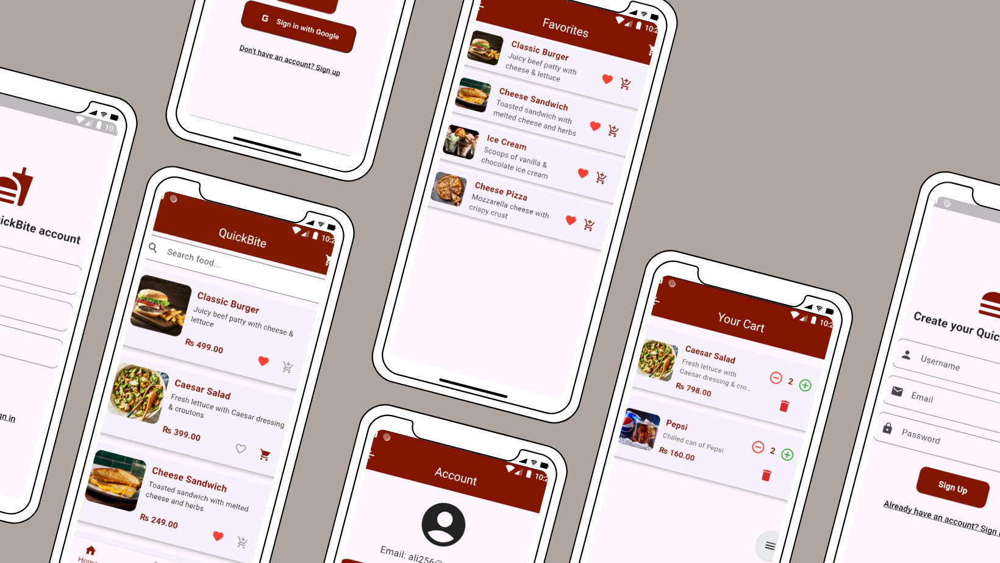

# QuickBite – Food Ordering App

##  Overview
QuickBite is a modern food delivery app made using Flutter and Firebase. Users can browse food items, manage cart, place orders, and track favorites.

##  Features
- User Sign In/Up
- Add to Cart, Favorites
- Update Item Quantity
- Place Orders with Address
- Firebase Firestore Integration

## Tools & Tech
- Flutter
- Firebase Firestore + Auth
- Canva / Photopea (for mockups)

## Code Structure
- `models/`: Data models (FoodItem)
- `screens/`: UI screens
- `services/`: Firestore integration
- `main.dart`: App entry point

## UI Mockups


## How to Run
```bash
flutter pub get
flutter run
